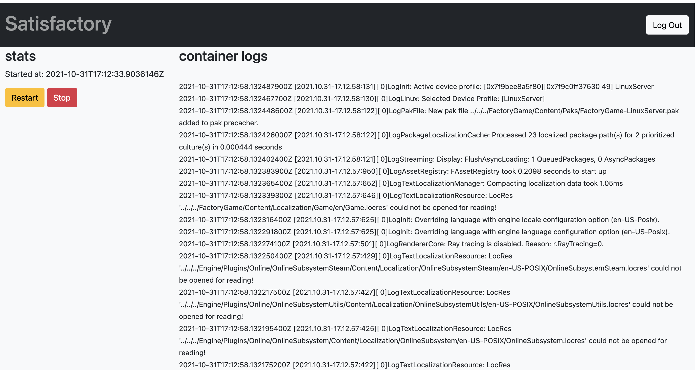

# Dockerized Dedicated Satisfactory
> Simple environment to serve a dedicated server for Satisfactory. 

It spins up 3 containers. The dedicated server itself, a postgres container and a container serving a simple Web-UI.

The Web-UI container serves a flask application to stop/restart/start the dedicated server.  
Additionally, it shows the log of the dedicated server.



## Requirements
Docker and Docker-Compose will be used.
Everything else will be installed inside the containers.

## Build and Run
### .env
To configure the environment create a `.env` file inside the root of the project.  
The following values need to be set:
```shell
POSTGRES_PASSWORD="supersecret"
POSTGRES_USER="satisfactory"
HOSTNAME_POSTGRES="satisfactory_db"
HOSTNAME_UI="satisfactory_ui"
HOSTNAME_SERVER="satisfactory_server"
DOCKER_SOCKET="/var/run/docker.sock"  # the path to the docker socket
ADMIN_PASSWORD="supersecret"  # the password the admin user (will be created on first start)
FLASK_SECRET="supersecret"  # replace with a strong secret for Flask
```

### Start
At the root of the project simply run
```
docker-compose up -d
```
At the first start it will build and download everything what it needs to spin up the containers.

### Stop
```
docker-compose down
```

### Rebuild
In case changes were made to the project, tell docker-compose to build everything again.  
Run:
```
docker-compose build
```

## Network
The dedicated server will expose the following ports to the host:
```
- 15777 (udp)
- 15000 (udp)
- 7777 (udp)
```

The flask container exposes the following ports to the host:
```
- 5000 (tcp)
```

## Reverse Proxy
The container, serving the Flask application, will expose its service to the host on port 5000.
A reverse proxy should be used to proxy the application, as it wouldn't have any kind of encryption otherwise.